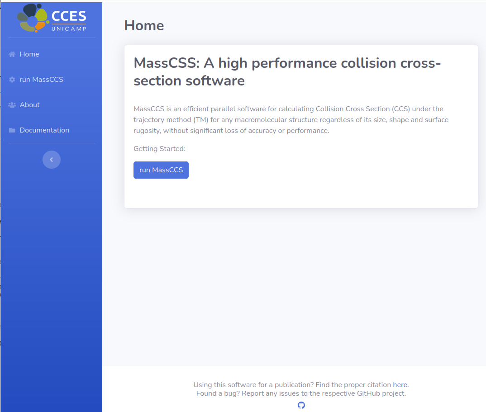
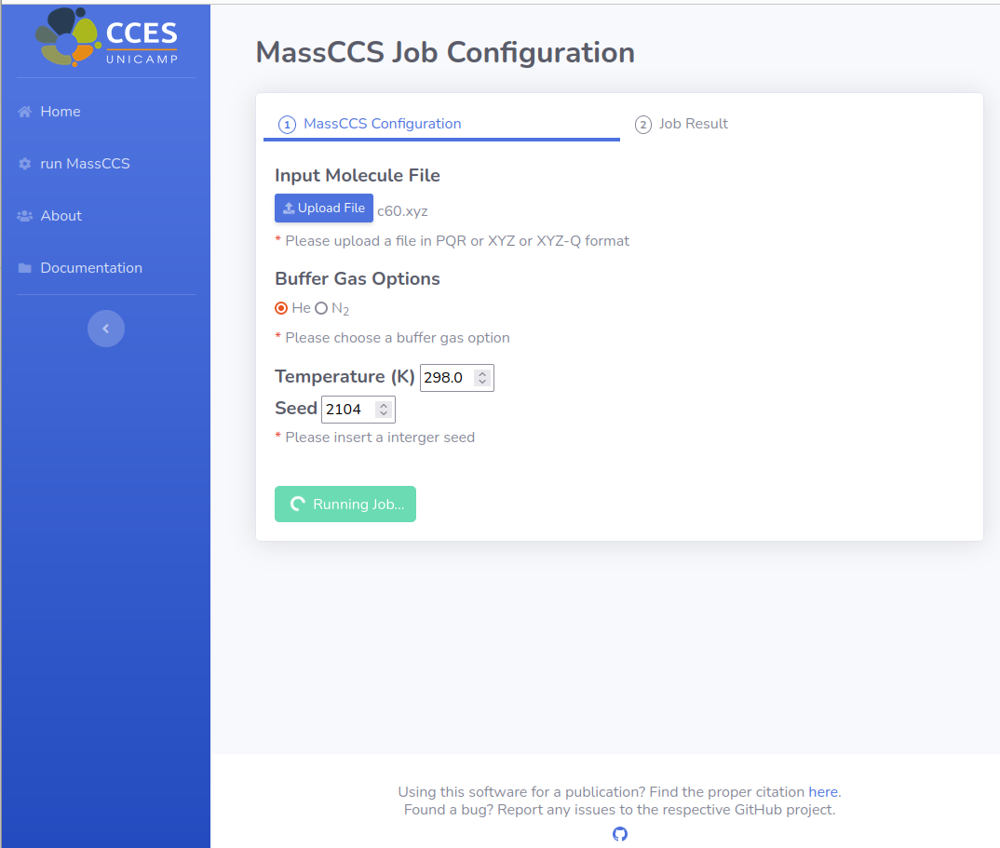
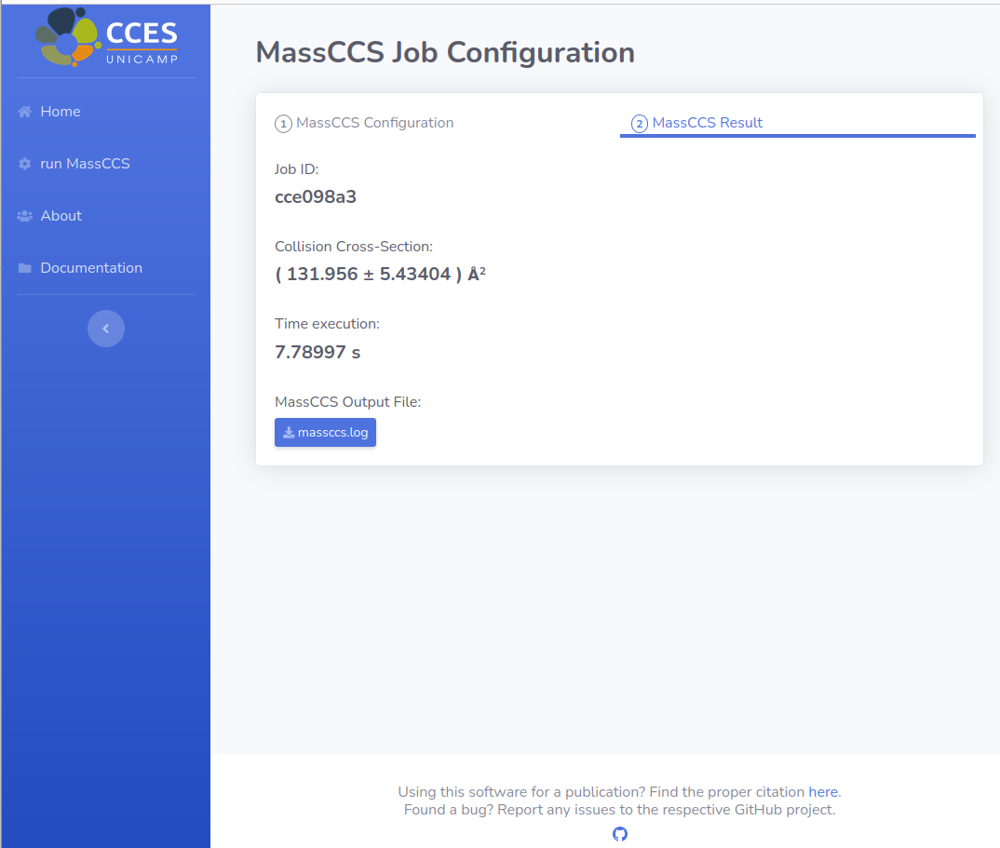

# massccs-web-server

MassCSS server is a project to run ["MassCCS"](https://github.com/cces-cepid/massccs) software free online with a simple interface and no installation requirements.

  

  

  

Currently available on AWS cloud for test in this link: 

If you use MassCCS server in your research please, cite the following papers:

["S. Cajahuaringa, D. L. Z. Caetano, L. N. Zanotto, G. Araujo and M. S. Skaf, MassCCS: A high performance collision cross-section software for large macromolecular assemblies, J. Chem. Inf. Model. 2023, 63, 11, 3557–3566"](https://doi.org/10.1021/acs.jcim.3c00405)

["S. Cajahuaringa, L. N. Zanotto, D. L. Z. Caetano, S. Rigo, H. Yviquel, M. S. Skaf and G. Araujo, Ion-Molecule Collision Cross-Section Simulation using Linked-cell and Trajectory Parallelization, 2022 IEEE 34th International Symposium on Computer Architecture and High Performance Computing (SBAC-PAD), Bordeaux, France, 2022, pp. 150-159."](https://ieeexplore.ieee.org/abstract/document/9980906)

Author & Contact:
--------------
Samuel Cajahuaringa - samuelcm@unicamp.br

